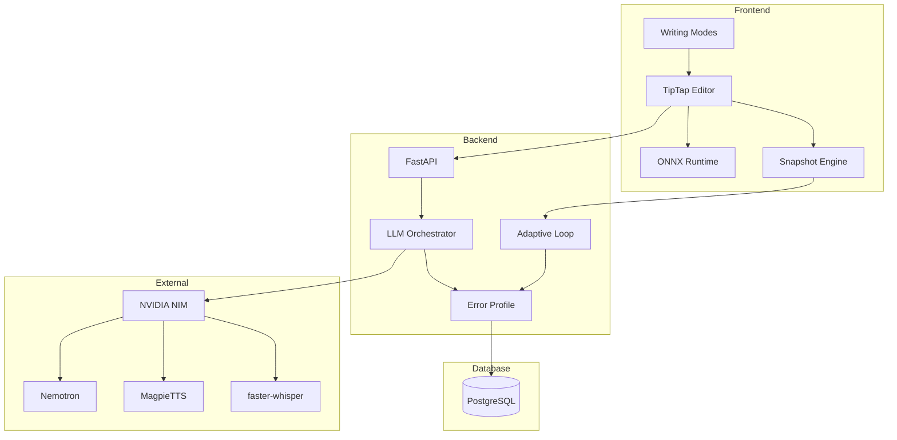

# How It Works

A complete overview of DysLex AI's architecture, learning system, and design philosophy.

---

## Design Principles

1. **Voice-first, text-second.** Voice input is a first-class citizen, not an afterthought.
2. **Structure emerges, not imposed.** Let ideas flow freely, then help organize them.
3. **Corrections are invisible.** Never interrupt creative flow. Fix spelling and grammar silently in the background.
4. **Show progress, not deficits.** "500 words written today" — never "23 errors found."
5. **Respect the person.** The user is intelligent. They need better tools, not simpler ideas.

---

## System Architecture



```
┌─────────────────────────────────────────────────────────────────┐
│                          Frontend                                │
│  ┌──────────────┐  ┌──────────────┐  ┌──────────────────────┐   │
│  │   TipTap     │  │    ONNX      │  │   Passive Learning   │   │
│  │   Editor     │  │   Runtime    │  │   Snapshot Engine    │   │
│  └──────────────┘  └──────────────┘  └──────────────────────┘   │
└─────────────────────────────────────────────────────────────────┘
                              │
                              ▼
┌─────────────────────────────────────────────────────────────────┐
│                          Backend                                 │
│  ┌──────────────┐  ┌──────────────┐  ┌──────────────────────┐   │
│  │   FastAPI    │  │     LLM      │  │   Adaptive Loop      │   │
│  │   Routes     │  │ Orchestrator │  │   Processor          │   │
│  └──────────────┘  └──────────────┘  └──────────────────────┘   │
└─────────────────────────────────────────────────────────────────┘
                              │
              ┌───────────────┼───────────────┐
              ▼               ▼               ▼
┌──────────────────┐  ┌──────────────┐  ┌──────────────┐
│    PostgreSQL    │  │  NVIDIA NIM  │  │  NVIDIA NIM  │
│  Error Profiles  │  │   Nemotron   │  │  MagpieTTS   │
└──────────────────┘  └──────────────┘  └──────────────┘
```

### Key Components

**Frontend:** TipTap-based rich text editor, four writing modes (Capture, Mind Map, Draft, Polish), ONNX Runtime for browser-based inference, snapshot engine for passive learning.

**Backend:** LLM Orchestrator for two-tier routing, Error Profile service for per-user pattern storage, Adaptive Loop for processing learning signals.

**External Services:** NVIDIA NIM for Nemotron deep analysis, MagpieTTS for TTS, faster-whisper for STT.

---

## Three-Model Architecture

DysLex AI combines three models that work together. Each handles a different job, and they pass information between each other to create a system that improves with every use.

### Model 1: User Error Profile

**Type:** Statistical / Pattern Database | **Runs:** PostgreSQL (server)

Builds a fingerprint of each user's specific dyslexic error patterns. Every person with dyslexia makes different mistakes — this model captures those unique patterns and uses them to make the other two models smarter.

What it stores:
- **Error frequency map** — `"becuase" -> "because" (47 times)`, `"teh" -> "the" (112 times)`
- **Error type classification** — letter reversal: 34%, phonetic substitution: 28%, homophone confusion: 22%, omission: 16%
- **Confusion pairs** — their/there/they're, effect/affect, which/witch
- **Improvement tracking** — "teh" errors: 15/week → 3/week over 2 months
- **Context patterns** — errors increase in longer documents, fewer in familiar topics

### Model 2: Quick Correction

**Type:** DistilBERT token classifier (~66M params) | **Runs:** ONNX Runtime Web (browser)

A small language model that runs directly on the user's device. It detects where errors occur using BIO tagging, then resolves corrections through a layered dictionary lookup (base dictionary + user's personal error profile). No network latency, no API costs. Personalized to each user's error profile so it gets better at catching that specific person's mistakes over time.

**Latency target:** Under 50ms per correction. **Error types detected:** Letter reversals (b/d, p/q), transpositions (teh→the), phonetic substitutions (fone→phone), omissions (wich→which), insertions (thhe→the), general spelling.

### Model 3: Deep Analysis

**Type:** Large Language Model | **Runs:** NVIDIA NIM (cloud)

The most powerful part of the system. Understands the full context of what the user is trying to say. Catches errors that no traditional spell checker can: real-word errors, homophones in wrong context, severely misspelled words where intent must be inferred, and grammar issues specific to dyslexic writing patterns.

---

## Two-Tier Processing

| Tier | When Used | Speed |
|------|-----------|-------|
| **Tier 1: Quick** | Common errors, known patterns, real-time typing | Under 500ms |
| **Tier 2: Deep** | Complex real-word errors, full-document analysis, intent inference | 1-5 seconds |

The system automatically routes each correction to the right tier — simple fixes happen instantly, complex ones get deeper analysis. If the ONNX detector flags 4+ errors in a sentence, it bypasses the local model and sends directly to the LLM.

---

## Passive Learning Loop

There are **no accept/reject buttons. No pop-ups. No interruptions.** The system learns by silently observing natural writing behavior.

### Five Passive Signals

| What You Do | What the System Learns |
|-------------|----------------------|
| You go back and fix your own typo | This is an error you make AND recognize — catch it earlier next time |
| You leave a flagged word alone across sessions | Might be intentional (name, slang, jargon) — add to personal dictionary |
| You rewrite a section and a word changes unexpectedly | Captures your true intent — high-value training data |
| You write the same misspelling in 5 documents | Persistent error — prioritize it in the instant correction model |
| An error you used to make stops appearing | You've internalized it — reduce priority and note improvement |

### How It Works Under the Hood

1. Text snapshots are taken every 5-10 seconds while typing
2. Additional snapshots when the user pauses for 3+ seconds
3. A background diff engine (LCS algorithm) compares snapshots to detect word-level changes
4. Self-corrections are filtered by similarity (0.3 < similarity < 0.95)
5. Error type is classified (letter reversal, homophone, phonetic, omission, spelling)
6. The error profile updates automatically
7. Corrections improve without any user action
8. Snapshots stored in Redis with 24-hour TTL for privacy

### Why Passive Learning Is Better

- **Zero cognitive load** — no decisions means focus entirely on writing
- **Zero stigma** — no visible accept/reject buttons on screen
- **Zero friction** — works like a normal word processor
- **Better data quality** — natural behavior produces honest training data

---

## Dynamic Prompt Architecture

The LLM prompt is dynamically constructed for each user based on their error profile:

- Loads the user's top 20 most common errors
- Includes their error type breakdown and confusion pairs
- Estimates writing level from historical data
- Instructs the model to prioritize the user's known patterns
- Returns structured JSON for the frontend to display inline

---

## Four Writing Modes

### 1. Capture Mode — Voice-to-Thought

Tap the microphone and speak freely. The AI transcribes in real-time and organizes ideas into draggable thought cards. Beyond transcription, it identifies key ideas, potential arguments, examples, and emotional tone. Upload images of handwritten notes or diagrams to extract ideas visually.

### 2. Mind Map Mode — Organize Ideas

Thought cards become a visual mind map. Ideas are clustered by theme. Drag, connect, and reorganize freely. The AI suggests connections ("This example supports that argument") and identifies gaps ("You have a strong intro and conclusion, but the middle needs more support").

### 3. Draft Mode — Scaffolded Writing

A three-column layout designed for focused writing:
- **Left** — Essay scaffold with progress tracking and suggested paragraph order
- **Center** — Main editor with inline corrections and AI coach nudges
- **Right** — Corrections panel showing suggestions with explanations

Passive learning runs silently in the background. Includes a passive frustration detection system that monitors writing behavior (rapid deletion, long pauses, short bursts, cursor thrashing) and offers gentle, empathetic support when needed.

### 4. Polish Mode — Review and Refine

The final pass:
- **Tracked changes view** — see all suggested edits with accept/dismiss controls
- **Readability scoring** — understand how your writing reads
- **Structural suggestions** — AI analyzes overall flow, argument strength, and coherence
- **Session summary** — see what you accomplished in this writing session
- Uses Tier 2 deep analysis for style and structure suggestions

---

## Voice and Text-to-Speech

### Voice Input (faster-whisper)
- Real-time transcription powered by faster-whisper (optimized Whisper large-v3)
- Idea extraction — identifies key ideas, arguments, examples, and emotional tone
- Spoken ideas become draggable thought cards
- Multilingual support

### Text-to-Speech (MagpieTTS)
- Natural voices in English, Spanish, French, and more
- Highlight any section and hear it spoken back
- Full document playback with speed control (0.5x-2.0x)
- Falls back to browser SpeechSynthesis when MagpieTTS is unavailable

### Vision Input (Cosmos Reason2 8B)
- Upload images, diagrams, handwritten notes, or whiteboard photos
- Converts visual content into structured thought cards
- Handwriting recognition and diagram interpretation

---

## Export and Sharing

Export documents in four formats: DOCX (Word), PDF, HTML, and plain text. All exports support automatic title extraction, metadata inclusion, and proper filename generation. Keyboard-accessible export menu with full ARIA support.

---

## Accessibility

The interface looks like a normal, modern word processor. **Nobody should be able to tell it's assistive software by looking at someone's screen.**

### Typography
- **Specialized fonts** — OpenDyslexic, Atkinson Hyperlegible, Lexie Readable
- **Minimum 16px** font size with 1.5-2.0 line spacing
- **Increased letter and word spacing** (0.05-0.12em)

### Color and Contrast
- No pure black on pure white — warm dark gray on off-white/cream
- Multiple background tints: cream, light blue, light green, gray
- WCAG AA contrast ratios (4.5:1 minimum)
- Color is never the only indicator — always paired with icons or text

### Design Tokens

**Cream Theme (Default):**
```css
--color-bg-primary: #fdf6e3;
--color-bg-secondary: #f5eed6;
--color-text-primary: #3d3d3d;
--color-text-secondary: #5a5a5a;
--color-accent: #4a90a4;
```

**Night Theme:**
```css
--color-bg-primary: #1a1a2e;
--color-bg-secondary: #252542;
--color-text-primary: #e8e8e8;
--color-text-secondary: #b8b8b8;
--color-accent: #6ab0c4;
```

**Correction Colors:** Soft red (spelling), soft blue (grammar), soft orange (confusion), soft green (phonetic).

### Invisible Corrections
- Subtle colored underlines, not aggressive red squiggles
- No pop-ups or dialogs — corrections appear inline
- Focus mode dims everything except the current paragraph

### Progress Dashboard
- Shows improvement positively: "Words mastered", "Writing streak", "Ideas captured"
- Never shows error counts or deficit framing
- Charts for weekly error trends, improvement sparklines, and top corrections
- Private — only the user sees their own data

---

## NVIDIA NIM Integration

All cloud AI services are accessed through a single NVIDIA NIM API key via `https://integrate.api.nvidia.com/v1`.

| Product | Model | Role |
|---------|-------|------|
| **Nemotron-3-Nano-30B-A3B** | `nvidia/nemotron-3-nano-30b-a3b` | Deep text analysis — corrections, homophones, real-word errors, intent inference |
| **Llama 3.1 Nemotron Nano VL 8B** | `nvidia/llama-3.1-nemotron-nano-vl-8b-v1` | Vision — converts images and diagrams into thought cards |
| **MagpieTTS Multilingual** | `nvidia/magpietts` | Text-to-speech — read-aloud in English, Spanish, French, and more |
| **faster-whisper** | Whisper large-v3 (optimized) | Speech-to-text — real-time voice input for Capture Mode |

---

## Database Schema

```
┌──────────────┐     ┌──────────────────┐     ┌──────────────┐
│    users     │────<│   error_logs     │     │ error_patterns│
├──────────────┤     ├──────────────────┤     ├──────────────┤
│ id (PK)      │     │ id (PK)          │     │ id (PK)      │
│ email        │     │ user_id (FK)     │     │ name         │
│ name         │     │ original_text    │     │ description  │
│ password_hash│     │ corrected_text   │     │ category     │
│ created_at   │     │ error_type       │     │ examples     │
│ updated_at   │     │ context          │     └──────────────┘
└──────────────┘     │ confidence       │
       │             │ was_accepted     │
       │             │ created_at       │
       │             └──────────────────┘
       │
       ▼
┌──────────────────┐     ┌──────────────────┐
│  error_profiles  │     │ confusion_pairs  │
├──────────────────┤     ├──────────────────┤
│ id (PK)          │     │ id (PK)          │
│ user_id (FK)     │     │ language         │
│ overall_score    │     │ word1            │
│ patterns (JSONB) │     │ word2            │
│ confusion_pairs  │     │ category         │
│ achievements     │     │ frequency        │
│ updated_at       │     └──────────────────┘
└──────────────────┘
       │
       ▼
┌──────────────────┐
│  user_progress   │
├──────────────────┤
│ id (PK)          │
│ user_id (FK)     │
│ date             │
│ words_written    │
│ corrections_made │
│ accuracy_score   │
└──────────────────┘
```

- **users** — Core user information and authentication
- **error_profiles** — User's personalized error profile (patterns JSONB, confusion pairs JSONB, achievements JSONB)
- **error_logs** — Historical log of all detected errors and corrections
- **confusion_pairs** — Language-specific confusion pair database (shared across users)
- **error_patterns** — Predefined dyslexia error pattern categories
- **user_progress** — Daily progress tracking for analytics and achievements
